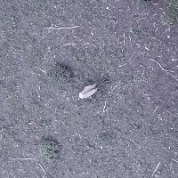
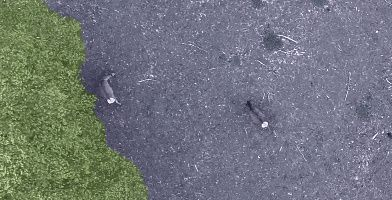
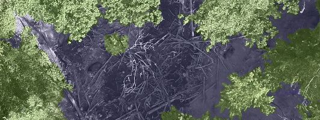
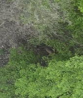
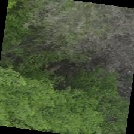
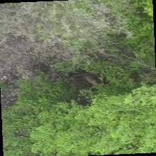

# Data annotation and augmentation by Andrej Majev

Table of contents:

- [Annotation process](#annotation-process)
- [Augmentation](#augmentation)

## Annotation process

The classes that we chose are the varying degrees of tree density - open, sparse and dense.

||Open|Sparse|Dense|
|---|---|---|---|
|Original image||||
|Trees highlighted||||

Open - no trees visible in image <br>
Sparse - few trees are visible mostly from one side (one tree / one group of trees) <br>
Dense - a lot of trees are visible from multiple sides (surrounded by trees) <br>


The classes are additionally each split into regular, leafless and snowy subtypes 

|Regular|Leafless|Snowy|
|---|---|---|
|||


For image annotation annotator.py was used

## Augmentation

The loadign, augmentation and splitting can be found in [data_loading_augmentation.py](../notebooks/data_loading_augmentation.py)


All splits are resised and transformed to tensors:

``` python
transforms.Resize((224, 224)),
transforms.ToTensor()
```

The training dataset is also augmented:

``` python
transforms.RandomHorizontalFlip(),
transforms.RandomRotation(10),
transforms.ColorJitter(brightness = 0.2)
```

|Original image|Augmented 1|Augmented 2|
|---|---|---|
|||

