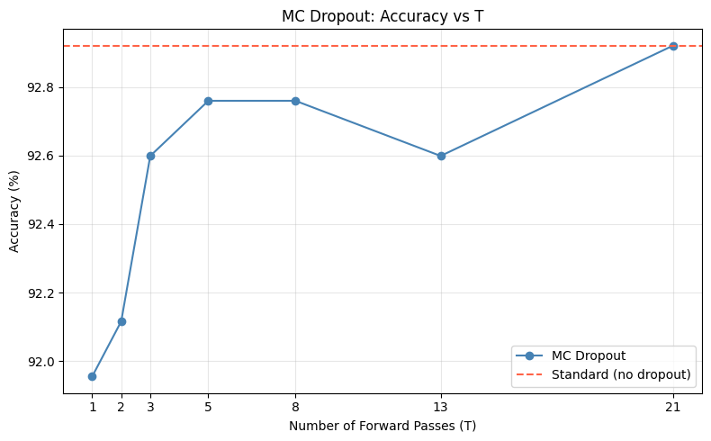
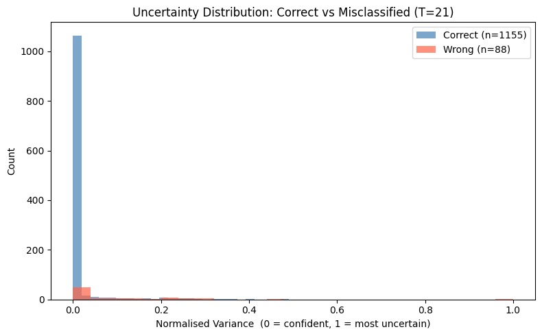
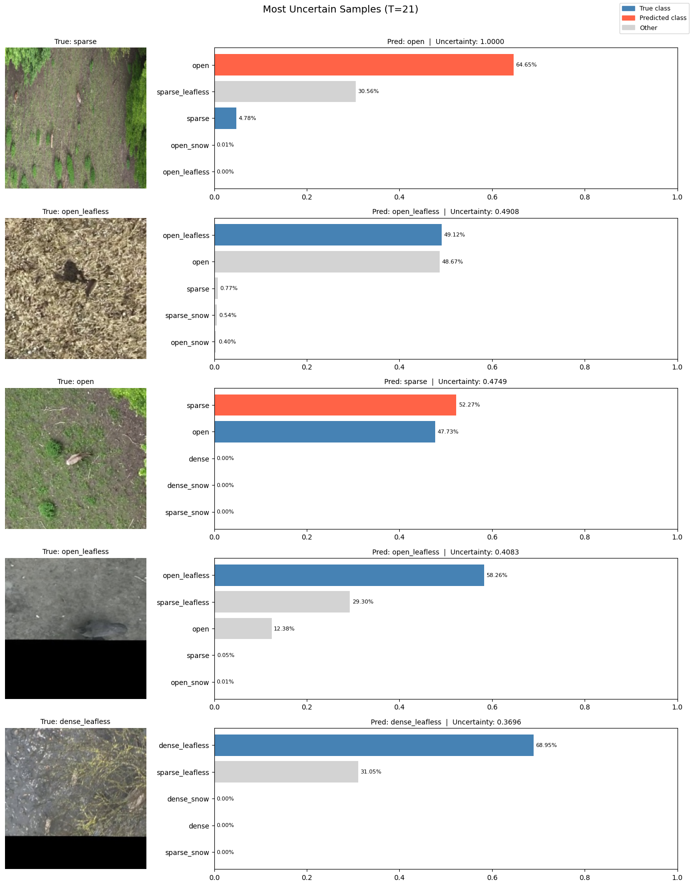
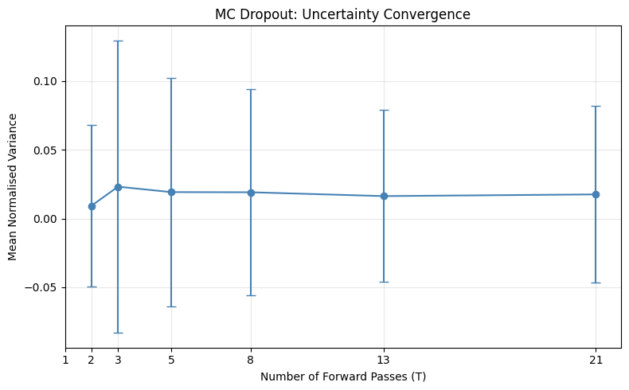
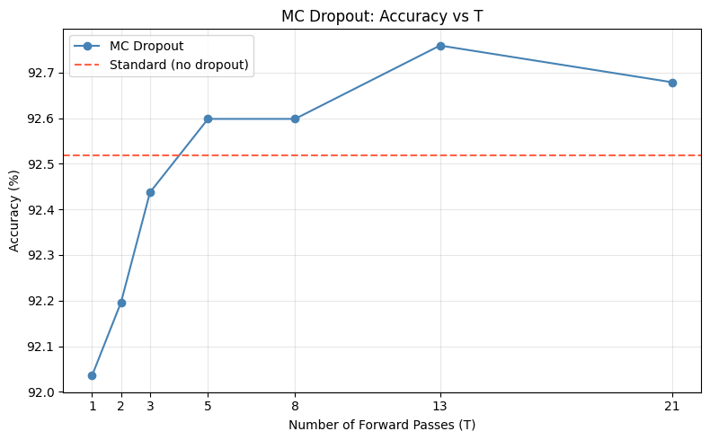
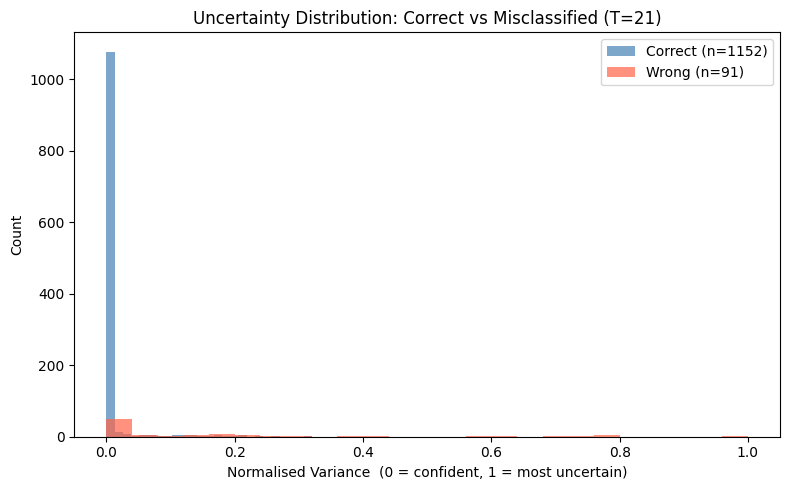
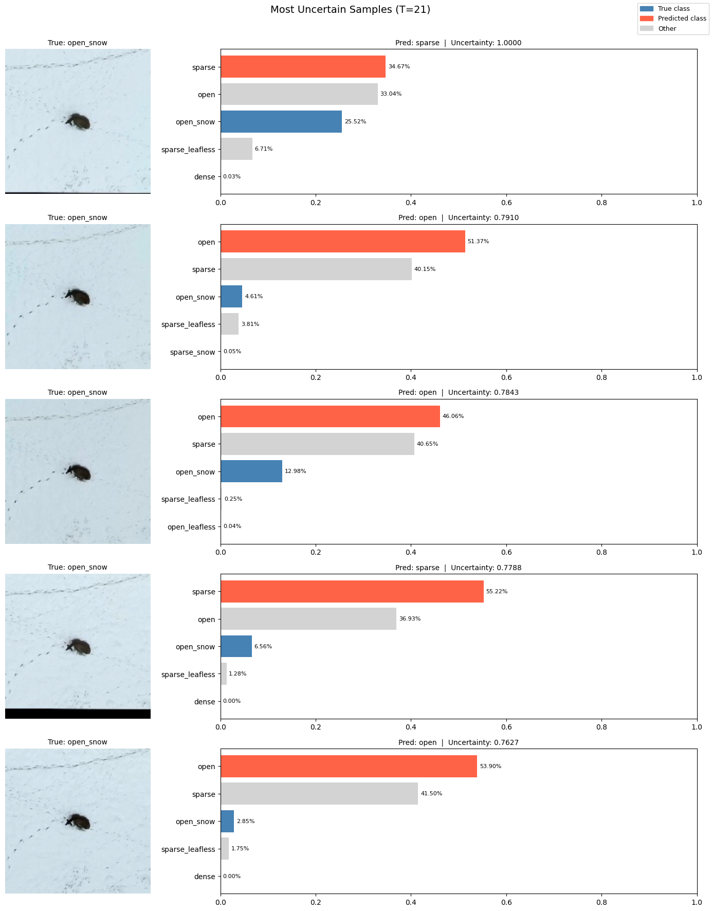
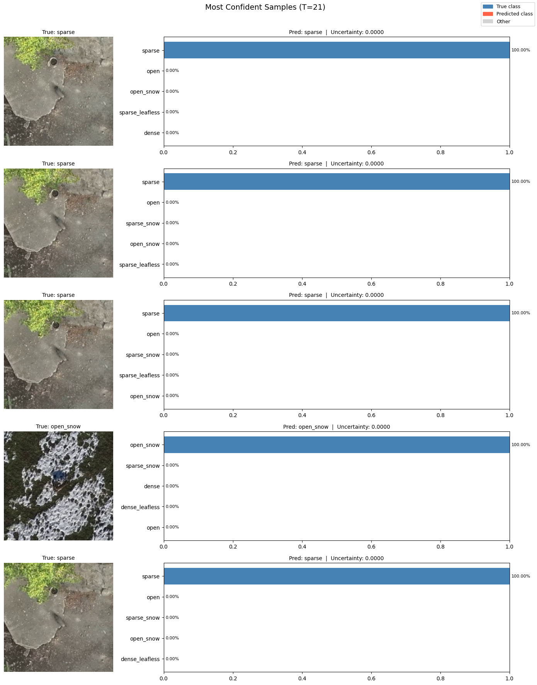
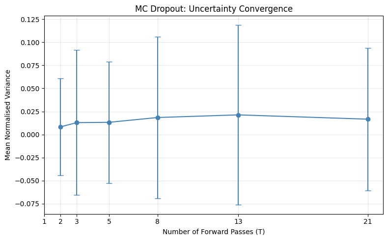
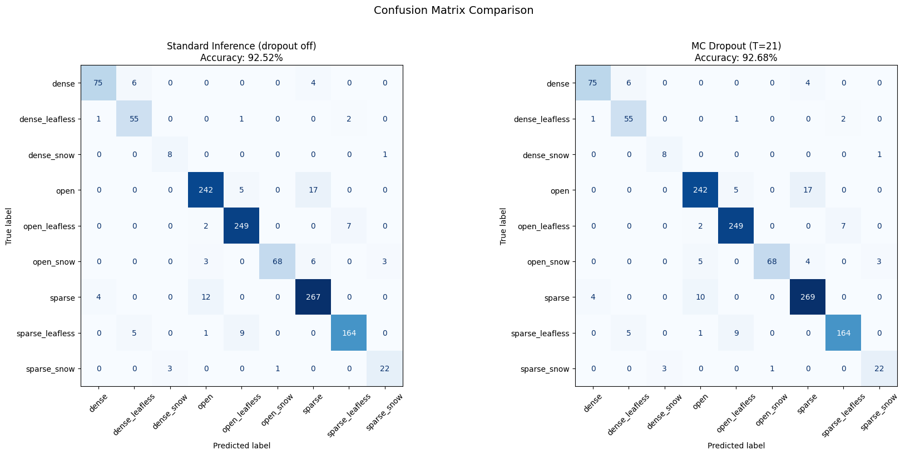

## Files: train_mode.ipynb, train_model_efficientnetv2-s.ipynb, monte_carlo_dropout_mobilenetv3.ipynb and monte_carlo_dropout_efficientnetv2-s.ipynb + everything in /notebooks/models

### Trained two different models, one pretrained with MobileNetV3 and one pretrained with EfficientNetV2

#### Architecture

[Pretrained ImageNet backbone]   ← all layers, fully trainable
        ↓
  Global Average Pooling
        ↓
  [New classifier head]          ← randomly initialized, fits your NUM_CLASSES
        ↓
   Output (9 classes)

(At least I believe this is how it should look like)

We are training the final linear layer, everything before comes from the pretrained weights. 

#### Differences

MobileNetV3-Small has a more complex head: Conv → HardSwish → AdaptiveAvgPool → Conv → HardSwish → Dropout → Linear. The dropout lives inside this structure.

EfficientNetV2-S has a simpler head: AdaptiveAvgPool → Dropout → Linear. The drop_rate we pass in applies to that single dropout before the linear.

#### Decisions

There is a Batch size of 32 for now, it worked with out first try good which had a smaller size and for now it is still this size. 

The learning rate is 1e-4, which is pretty standard and based on the val loss and accuracy works good. 

It also includes a dropout rate of 0.2.

A random seed (42) is also included for reproducability.  

#### What we save

We save for each model the metadata, the model to load it again, the predictions for the habitats (name of picture and prediction) and the training_history. 

#### Further uses

We have in both train_model files Grad-CAM to check what the model looks at, a confusion Matrix to check if it makes sense what it misclassifies and where the biggest confusions are and a potential Monte Carlo Dropout usecase, if we have the time/want to look into that. 

#### Setup

Setting all the starting parts (all of the decisions + model), including also a part for potential Fashion_Mnist testing purposes, just to see if everything works before having the data ready. 

#### Model definition

Building the model, based on our setup + checking out a quick model summary to see if it looks correct.

#### Data Loading

Getting the Data we are about to use from the data_loading_augmentation file. Checking for the length of them and for the classes to see if everything was loaded correctly.

#### Training Helpers

Includes the functions: 
- for training one Epoch, gives us back the loss and the accuracy.
- for evaluation on the validation set, gives also back the loss and the accuracy
- for testing the model, which runs on the test set. It gives back the accuracy, balanced accuracy, the predictions and the labels for the data. 
- a function for plotting the the loss and the accuracy after training. 

#### Training Loop

Gets the criterion and the optimizer (in our case CrossEntropyLoss and Adam), goes through the training epoch and evaluation functions to train the layer. 
Prints for us to see the Epochs + the loss and accuracy for both the train and validation dataset.

#### Results

Plots the Accuracy and Loss of the model, also tests the model on the testset. It then prints the test and the balanced accuracy. 

#### Save Model & History

Saves:
- full `state_dict` (the model itself)
- per-epoch loss & accuracy in a csv
- the predictions for the habitat on the test set in a csv
- metadata of the model for reproducability as json

#### Grad Cam

Firstly calculating how correct we where and how many samples we did wrong based on the test labels and the test predictions. 

Then getting the target layer to work with with GradCam and GradCamPlusPlus. Here we need to Convert our normalizzed tensor from the target layer back to display an RGB Image.

THen a function to show us the images with the predictions and the actual labels to see which parts where mostly looked at and if it makes sense. We once have it for misclassified pictures and once for correctly classified ones

#### Confusion Matrix

very simple, just a Confusion Matrix to check what it classifies as what. To check if our misclassifications make sense or if they do not make sense. Again based on the test set. 

### Mobile Net V3 Small results

Last Epoch: Epoch 50/50  train_loss=0.0616  train_acc=0.979  val_loss=0.5282  val_acc=0.912

Test Accuracy : 92.92%

Test Balanced Accuracy : 93.53%

Based on test set:

Correct: 1155, Misclassified: 88 (7.1%)

### Efficient Net V2 Small results

Last Epoch: Epoch 50/50  train_loss=0.0272  train_acc=0.994  val_loss=0.4317  val_acc=0.910

Test Accuracy : 92.52%

Test Balanced Accuracy : 90.46%

Based on test set:

Correct: 1150, Misclassified: 93 (7.5%)

### General Conclusion

If one looks at the confusion matrices, it makes sense why the model misclassified certain images. The confusion happens between the open/sparse classes or sparse/dense classes which are easy to confuse in my opinion. There is no confusion that is not understandable.

### Using MC Dropout

We applied MC Dropout to both trained models, keeping dropout active at inference time and sweeping T = 1, 2, 3, 5, 8, 13, 21 forward passes per image.

### What we did

For each T, we run T stochastic forward passes and average the softmax outputs to get the final prediction. The variance across passes gives us a per-sample uncertainty score, normalized to [0, 1].

We also compare the confusion matrices of standard inference vs MC Dropout (T=21) side by side, and print a per-class accuracy delta to see if averaging stochastic passes helped or hurt specific habitat classes.

### Results

#### Mobilenetv3

T=  1  acc=91.95%  mean_norm_var=nan

T=  2  acc=92.12%  mean_norm_var=0.0093

T=  3  acc=92.60%  mean_norm_var=0.0232

T=  5  acc=92.76%  mean_norm_var=0.0193

T=  8  acc=92.76%  mean_norm_var=0.0191

T= 13  acc=92.60%  mean_norm_var=0.0164

T= 21  acc=92.92%  mean_norm_var=0.0176

Baseline (dropout off) : 92.92%

Mean norm. variance — Correct : 0.0116

Mean norm. variance — Wrong : 0.0965

Predictions changed by MC Dropout : 2 / 1243 samples

Per-class accuracy:

| Class             | N   | Std Acc | MC Acc (T=21) | Δ (MC − Std) |
|-------------------|-----|----------|----------------|---------------|
| dense             | 85  | 84.71%   | 84.71%         | +0.00%        |
| dense_leafless    | 59  | 88.14%   | 88.14%         | +0.00%        |
| dense_snow        | 9   | 100.00%  | 100.00%        | +0.00%        |
| open              | 264 | 89.39%   | 89.77%         | +0.38%        |
| open_leafless     | 258 | 96.12%   | 95.74%         | -0.39%        |
| open_snow         | 80  | 96.25%   | 96.25%         | +0.00%        |
| sparse            | 283 | 96.11%   | 96.11%         | +0.00%        |
| sparse_leafless   | 179 | 91.06%   | 91.06%         | +0.00%        |
| sparse_snow       | 26  | 100.00%  | 100.00%        | +0.00%        |

##### Most Uncertain Samples

Top-5 Most Uncertain Samples (by sample index)

| T  | Rank 1 | Rank 2 | Rank 3 | Rank 4 | Rank 5 |
|----|--------|--------|--------|--------|--------|
| 1  | 0    | 1    | 2    | 3    | 4    |
| 2  | 462  | 835  | 588  | 100  | 834  |
| 3  | 399  | 493  | 122  | 40   | 120  |
| 5  | 834  | 835  | 84   | 16   | 669  |
| 8  | 835  | 1165 | 100  | 493  | 341  |
| 13 | 835  | 305  | 493  | 183  | 100  |
| 21 | 835  | 568  | 183  | 490  | 100  |

=== Top-5 Most Confident Samples (by sample index) ===

| T  | Rank 1 | Rank 2 | Rank 3 | Rank 4 | Rank 5 |
|----|--------|--------|--------|--------|--------|
| 1  | 0    | 1    | 2    | 3    | 4    |
| 2  | 1043 | 1047 | 633  | 702  | 632  |
| 3  | 1043 | 1047 | 633  | 711  | 622  |
| 5  | 1047 | 633  | 1043 | 625  | 1051 |
| 8  | 1043 | 1047 | 1051 | 633  | 711  |
| 13 | 1047 | 633  | 1043 | 1051 | 711  |
| 21 | 1047 | 1043 | 633  | 1042 | 1051 |

=== Ranking Overlap with T=21 (Jaccard) ===

| T  | Uncertain | Confident |
|----|-----------|------------|
| 1  | 0.00%     | 0.00%      |
| 2  | 25.00%    | 42.86%     |
| 3  | 0.00%     | 42.86%     |
| 5  | 11.11%    | 66.67%     |
| 8  | 25.00%    | 66.67%     |
| 13 | 42.86%    | 66.67%     |
| 21 | 100.00%   | 100.00%    |

#### Efficientnetv2

T=  1  acc=92.04%  mean_norm_var=nan

T=  2  acc=92.20%  mean_norm_var=0.0083

T=  3  acc=92.44%  mean_norm_var=0.0129

T=  5  acc=92.60%  mean_norm_var=0.0132

T=  8  acc=92.60%  mean_norm_var=0.0184

T= 13  acc=92.76%  mean_norm_var=0.0213

T= 21  acc=92.68%  mean_norm_var=0.0166

Baseline (dropout off) : 92.52%

Mean norm. variance — Correct : 0.0068

Mean norm. variance — Wrong : 0.1416

Predictions changed by MC Dropout : 4 / 1243 samples

Per-class accuracy:

| Class            | N   | Std Acc | MC Acc (T=21) | Δ (MC - Std) |
|------------------|-----|----------|----------------|---------------|
| dense            | 85  | 88.24%   | 88.24%         | +0.00%        |
| dense_leafless   | 59  | 93.22%   | 93.22%         | +0.00%        |
| dense_snow       | 9   | 88.89%   | 88.89%         | +0.00%        |
| open             | 264 | 91.67%   | 91.67%         | +0.00%        |
| open_leafless    | 258 | 96.51%   | 96.51%         | +0.00%        |
| open_snow        | 80  | 85.00%   | 85.00%         | +0.00%        |
| sparse           | 283 | 94.35%   | 95.05%         | +0.71%        |
| sparse_leafless  | 179 | 91.62%   | 91.62%         | +0.00%        |
| sparse_snow      | 26  | 84.62%   | 84.62%         | +0.00%        |

##### Most Uncertain Samples

Top-5 Most Uncertain Samples (by Sample Index)

| T  | Rank 1 | Rank 2 | Rank 3 | Rank 4 | Rank 5 |
|----|--------|--------|--------|--------|--------|
| 1  | 0    | 1    | 2    | 3    | 4    |
| 2  | 681  | 1165 | 387  | 677  | 368  |
| 3  | 676  | 687  | 675  | 682  | 677  |
| 5  | 678  | 683  | 40   | 676  | 675  |
| 8  | 681  | 682  | 688  | 675  | 678  |
| 13 | 681  | 688  | 675  | 676  | 682  |
| 21 | 678  | 676  | 677  | 681  | 683  |

Top-5 Most Confident Samples (by Sample Index)

| T  | Rank 1 | Rank 2 | Rank 3 | Rank 4 | Rank 5 |
|----|--------|--------|--------|--------|--------|
| 1  | 0    | 1    | 2    | 3    | 4    |
| 2  | 702  | 1004 | 713  | 720  | 740  |
| 3  | 70   | 1003 | 1010 | 740  | 625  |
| 5  | 720  | 702  | 1003 | 625  | 1002 |
| 8  | 740  | 999  | 1003 | 1004 | 701  |
| 13 | 1007 | 999  | 720  | 736  | 1005 |
| 21 | 999  | 1003 | 1007 | 740  | 1009 |

Ranking Overlap with T=21 (Jaccard)

| T  | Uncertain | Confident |
|----|-----------|------------|
| 1  | 0.00%     | 0.00%      |
| 2  | 25.00%    | 11.11%     |
| 3  | 25.00%    | 25.00%     |
| 5  | 42.86%    | 11.11%     |
| 8  | 25.00%    | 42.86%     |
| 13 | 25.00%    | 25.00%     |
| 21 | 100.00%   | 100.00%    |