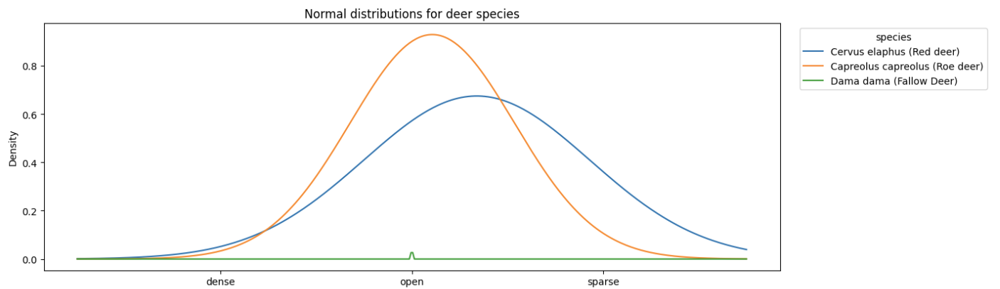

# Calculations and visualization by Bettina Pölzleitner

This document explains the following file: [cals_preds.ipynb](../notebooks/calc_preds.ipynb)

## Data Loading

The data is stored in images which are annotated, therefore information about each image needs to be loaded. The information about each image loaded is:

1. habitat
1. species
1. count
1. mean_variance
1. uncertainty_weight
1. weighted_counts

The latter information is due to the Monte-Carlo dropout and used to add that information in the calculation of the probabilities.

## Probabilities

Since the habitats have some classifications we do not need in the calculations, the habitats are merged to result in dense, open and sparse.

**Monte Carlo Dropout** 
The Monte Carlo dropout makes it easy to calculate the variance and the aggregate per-habitat, which groups the mean variance by the true habitat label and computes the habitat-level average variance. 

From the applied Monte Carlo dropout on the model we get weights to add in the calculations for the probabilities. Each habitat has a weight which is calculated with 
$$
w = \frac {1}{1+\sigma}.
$$
Therefore the higher the variance, the smaller is the weight while with a lower variance the weight is closer to 1. 

When the data is loaded, the species are counted and that count is multiplied with the weights. With that procedure the empirical frequency of the raw data is used and the counts multiplied with the weights add model uncertainty which in turn reduces the influence of less reliable habitat labels. 

### P(species|habitat)

This probability is calculated since we want to know what species in the habitats appear. The mathematical formula:

$$
P(species|habitat)= \frac {counts_{habitat,species}}{\sum_{\substack{\\species}}counts_{habits,species}}
$$

.png)

### P(habitat|species)

This probability is calculated to figure out where the animals are seen and to what extend. The mathematical formula:

$$
P(habitat|species)= \frac {counts_{habitat,species}}{\sum_{\substack{\\habitat}}counts_{habits,species}}
$$

.png)

### Distribution of Deer

To get more insight into similar species and where they appear, a normal distribution for each species in the same graph is plotted.

